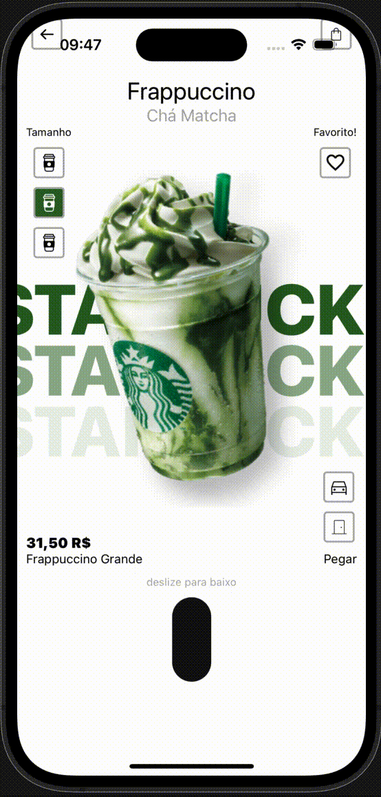

# Starbucks animate from figma design [figma](https://shorturl.at/9KAGL)


## 📸 Aperçu  
<p align="center">
  
</p> 
*Une démonstration en action !*  

---

## 🚀 Installation et exécution  

1. Clonez le dépôt :  
   ```bash
   git https://github.com/KamadoSama/react_native_startbucks_animate.git
   cd squid_game
   ```  

2. Installez les dépendances :  
   ```bash
   npm install
   ```  

3. Lancez l'application :  
   ```bash
   npx expo start
   ```  

4. Scannez le QR code avec l'application Expo Go pour tester sur un appareil mobile.  


## 🎉 Contribuer  
Les contributions sont les bienvenues !  
- Clonez le projet.  
- Créez une nouvelle branche pour vos modifications.  
- Ouvrez une pull request avec une description claire.  

---

## 📧 Contact  
Pour toute question ou suggestion, vous pouvez me joindre via [LinkedIn](https://www.linkedin.com/in/gnomblehi-ben-arthur-taho-5a05121a3/).  

---

Qu'en pensez-vous ? 😊